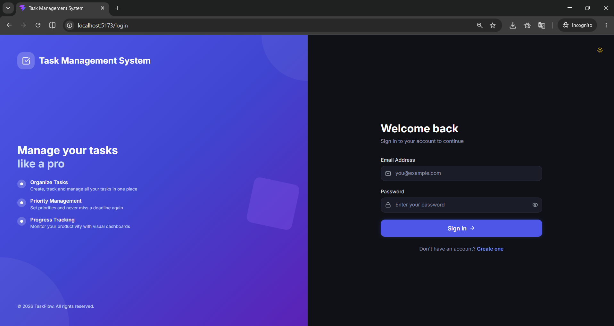
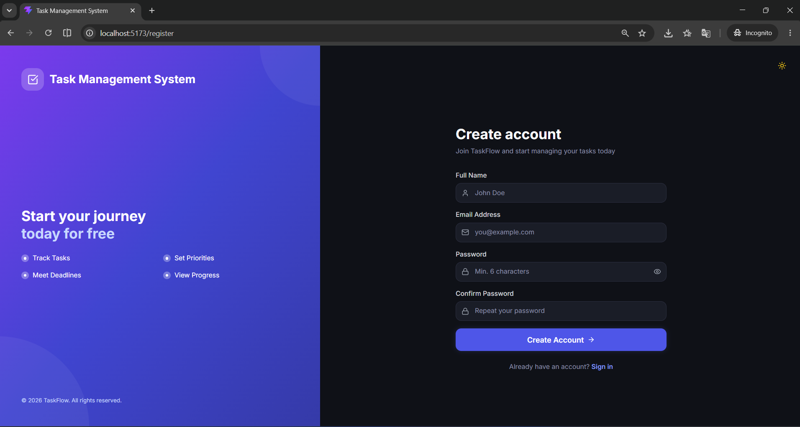
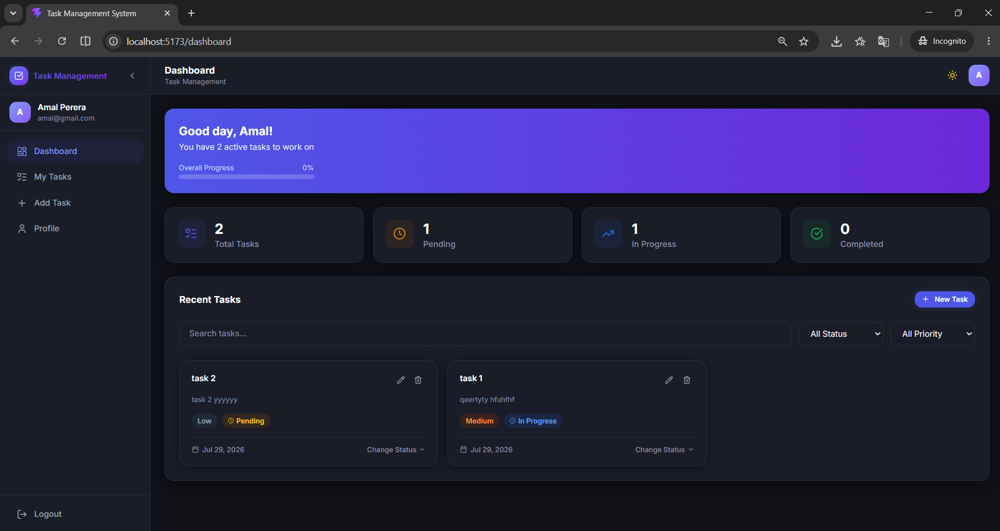
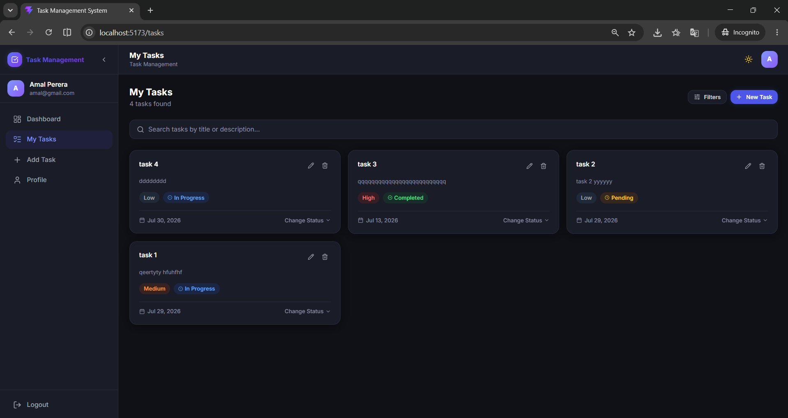
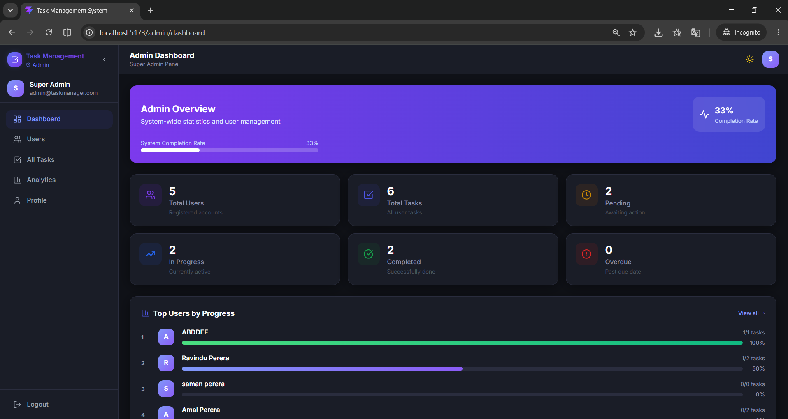
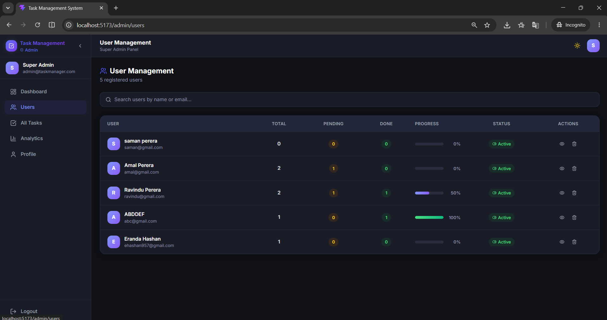

# Task Management App

A full-stack task management application built with React + Vite on the frontend and Node.js + Express + MongoDB on the backend. The app supports user authentication, task management, and an admin panel for managing users and tasks.

---

### 👤 User Features

- User Registration
- User Login & Logout
- JWT Authentication
- Protected Routes
- Create Tasks
- Edit Tasks
- Delete Tasks
- Update Task Status
- Filter Tasks by Status
- Filter Tasks by Priority
- Dashboard Statistics
- Responsive UI
- Light & Dark Mode

### 👑 Super Admin Features

- Secure Admin Login
- View All Registered Users
- View Every User's Tasks
- View User Task Progress
- Dashboard Analytics
- Manage All Tasks
- Delete Users (Optional)
- Activate / Deactivate Users (Optional)

---

# 📂 Project Structure

```text
Task-Management-System
│
├── backend
│   ├── src
│   ├── package.json
│   ├── seed.js
│   └── ...
│
├── frontend
│   ├── src
│   ├── public
│   ├── package.json
│   └── ...
│
├── screenshots
│   ├── login.png
│   ├── register.png
│   ├── dashboard.png
│   ├── task-list.png
│   ├── admin-dashboard.png
│   └── user-management.png
│
└── README.md
```

## Tech Stack

### Frontend
-- React.js (Vite)
- Tailwind CSS
- React Router DOM
- Axios
- React Hot Toast
- Lucide React

### Backend
- Node.js
- Express
- MongoDB + Mongoose
- JWT authentication
- bcryptjs
- CORS and Helmet

## Prerequisites

- Node.js (v18 or newer recommended)
- npm
- MongoDB instance (local or cloud, such as MongoDB Atlas)


---

# 📷 Application Screenshots

## 🔐 Login Page



---

## 📝 Register Page



---

## 📊 User Dashboard



---

## ✅ Task Management



---

## 👑 Admin Dashboard



---

## 👥 User Management



---


## Installation

1. Clone the repository
2. Install backend dependencies:
   ```bash
   cd backend
   npm install
   ```
3. Install frontend dependencies:
   ```bash
   cd ../frontend
   npm install
   ```

If you are using MongoDB Atlas, replace `MONGODB_URI` with your connection string.

## Running the Application

### Start the backend

```bash
cd backend
npm run dev
```

The API will run at http://localhost:5000.

### Start the frontend

```bash
cd frontend
npm run dev
```

The Vite app will run at http://localhost:5173.

## Seed the Admin User

To create the default admin account:

```bash
cd backend
npm run seed
```

## API Health Check

You can verify the backend is running with:

```bash
curl http://localhost:5000/api/health
```

## Notes

- The frontend expects the backend API at `http://localhost:5000/api` by default.
- If needed, you can override it by setting `VITE_API_URL` in the frontend environment.

# 🔐 Authentication

The project uses

- JWT Authentication
- bcrypt Password Hashing
- Protected Routes
- Role-Based Authorization

Roles

- User
- Admin

---

# 📋 Task Fields

Each task contains:

- Title
- Description
- Priority
  - Low
  - Medium
  - High
- Status
  - Pending
  - In Progress
  - Completed
- Due Date
- Created Date
- Updated Date

---

# 📈 Admin Dashboard

The Admin Dashboard provides:

- Total Users
- Total Tasks
- Pending Tasks
- In Progress Tasks
- Completed Tasks
- User Task Progress
- User Management
- Task Monitoring

---

# 🚀 Future Improvements

- Email Verification
- Forgot Password
- Task Search
- Pagination
- Charts & Analytics
- File Attachments
- Notifications
- Docker Deployment
- CI/CD Pipeline

---

# 👨‍💻 Author

**Eranda Hashan**

GitHub

https://github.com/Ehashan

Repository

https://github.com/Ehashan/Task-Management-System

---